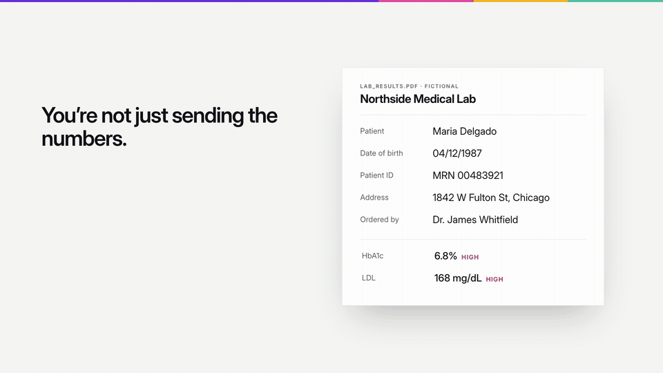
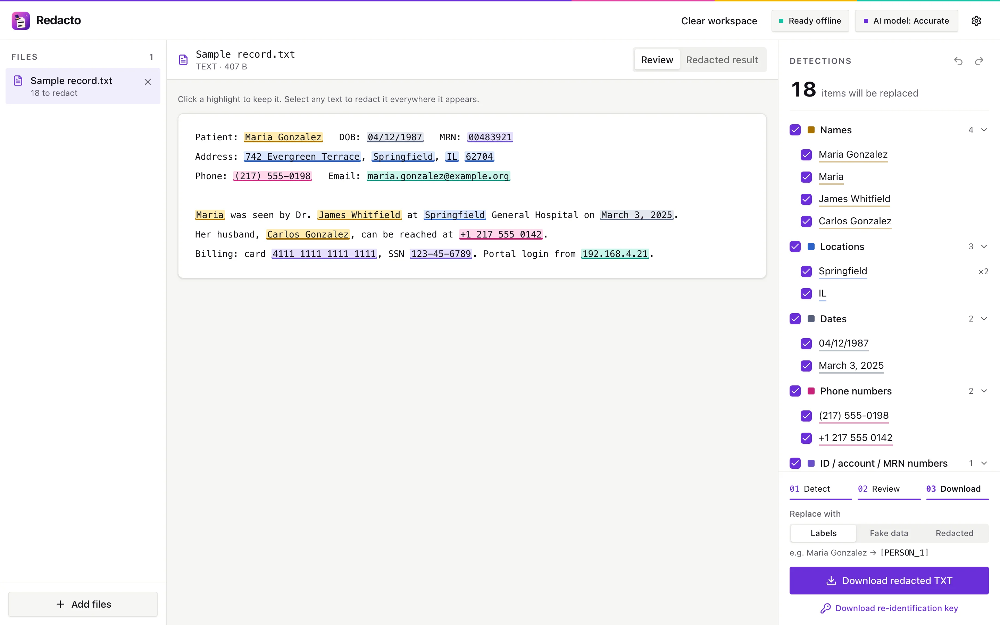
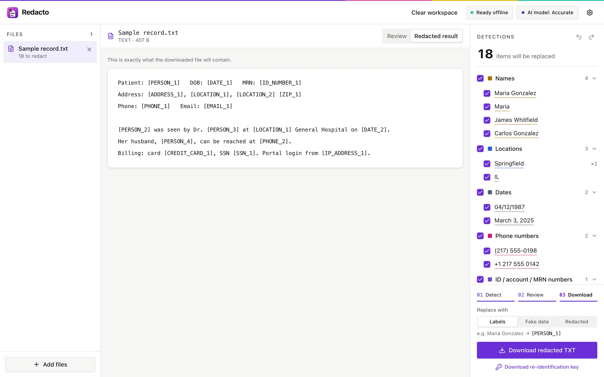
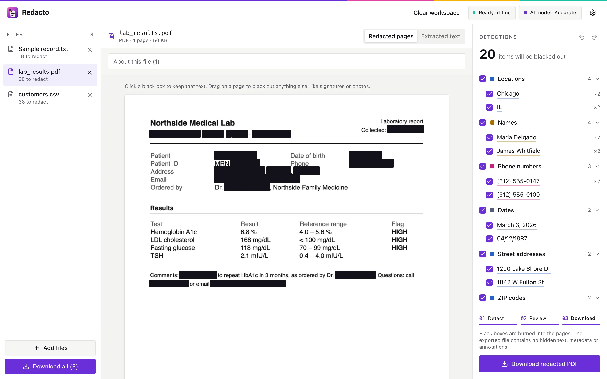
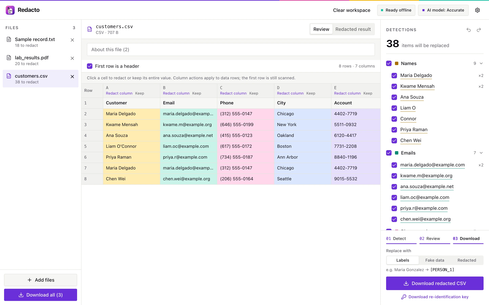
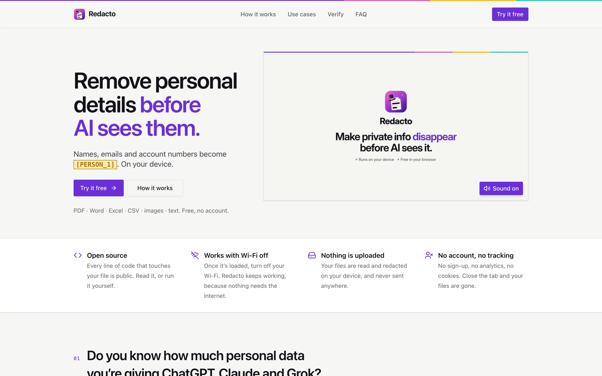
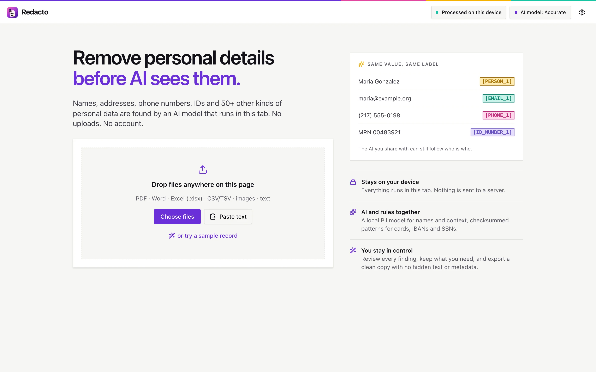

<div align="center">


# Redacto

**Make private info disappear before AI sees it.**

Remove names, addresses, account numbers and 50+ other kinds of personal data from PDFs, Word, Excel, images and text,
entirely in your browser. Nothing is uploaded.

**[Try it →](https://redacto.asad-moulvi01.workers.dev/app/)** · [Website](https://redacto.asad-moulvi01.workers.dev)

[](LICENSE)




</div>

---

## Why

You ask ChatGPT, Claude or Grok *"What should I be concerned about?"* and attach your lab results. The AI needs
the numbers. It doesn't need your name, birthday, patient ID, address or doctor, but it gets all of them, and they're
stored on someone else's servers.

Redacto takes those details out first, on your device, and replaces them with consistent labels:

```diff
- Patient: Maria Delgado   DOB: 04/12/1987   MRN: 00483921
- Ordered by: Dr. James Whitfield
+ Patient: [PERSON_1]   DOB: [DATE_1]   MRN: [ID_NUMBER_1]
+ Ordered by: [PERSON_2]
  HbA1c 6.8% (HIGH) · LDL 168 mg/dL (HIGH)
```

The same name always gets the same label, so the AI can still follow who is who, and the answer is just as useful.

## Features

- **Every common format:** PDF (including scans, via OCR), Word, Excel, CSV/TSV, PNG/JPG and plain text.
- **AI plus rules:** a local PII model finds names, places and context; checksum-validated patterns catch emails,
  phone numbers, SSNs, credit cards, IBANs, IPs, dates, addresses, ZIP codes and ID numbers.
- **You stay in control:** review every finding, keep what you need, redact anything by selecting it or dragging
  a box on the page. Undo and redo.
- **Three output styles:** labels (`[PERSON_1]`), realistic fake data, or `[REDACTED]`. PDFs and images get black
  boxes burned in, with no hidden text, metadata or annotations left behind.
- **A re-identification key** (optional): a CSV mapping each label back to the original, so you can read the AI's
  answer with the real names. Keep it to yourself.
- **Built for big files:** spreadsheets with hundreds of thousands of cells stay responsive. Repeated values are
  scanned once, and the grid only renders what's on screen.
- **No account, no tracking, no cookies.** Documents live in the tab's memory and are gone when you close it.

## Screenshots

| Review a document | The redacted result |
|---|---|
|  |  |
| **PDFs: black boxes burned into the pages** | **Spreadsheets: cell-by-cell review** |
|  |  |

<details>
<summary>Landing page and start screen</summary>




</details>

All documents in the screenshots and demo are fictional.

## Privacy, and how to check it

Redacto is a static web app. Everything happens in your browser tab:

- **No uploads.** Files are read, analysed and exported locally. The AI model is served with the app and runs in a
  Web Worker via [transformers.js](https://github.com/huggingface/transformers.js) and ONNX Runtime.
- **No other sites.** The production build ships a Content-Security-Policy that blocks every connection to another
  origin: no CDNs, no analytics, no fonts from elsewhere.
- **Works with the network off.** Once the badge at the top says **Ready offline**, turn off your Wi-Fi: opening,
  detecting and exporting all keep working. `scripts/check-offline.mjs` proves it on every format with the network cut.
- **Nothing persists.** Documents and custom terms stay in memory. Only general preferences (model, detection types,
  output style) are saved in your browser.

Check it yourself: open your browser's developer tools, watch the **Network** tab while you redact, and see that
nothing is sent.

> [!IMPORTANT]
> Automatic detection can miss things: unusual names, text inside photos, details that identify someone indirectly.
> Review every result before you share it. Redacto reduces what you share; it is not a compliance certification.

## Quick start

Requirements: Node 20.19+ (or 22.12+) and Python 3 (only for building the models once).

```bash
git clone https://github.com/WannaBeSolopreneur/redacto.git
cd redacto
npm install        # also copies wasm runtimes, OCR data and the fallback model into public/
npm run models     # one-time: builds the OpenMed PII models (python3; no PyTorch needed)
npm run dev        # http://localhost:5173 (landing page) and http://localhost:5173/app/ (the app)
```

Production build:

```bash
npm run build && npm run preview   # http://localhost:4173, with the strict Content-Security-Policy
```

## How it works

```
file ─► reader (pdf.js · OCR · docx · xlsx · csv) ─► text + positions
                                                        │
          regex & checksum rules ◄──────────────────────┤  instant
          local PII model (Web Worker) ◄────────────────┘  a few seconds
                                                        │
                    review: keep, add, undo  ◄──────────┘
                                                        │
          export: labels / fake data / [REDACTED] / black boxes, metadata scrubbed
```

1. **Read.** Each format has a loader that extracts text with exact positions: pdf.js for PDFs (pages without a text
   layer are OCR'd with Tesseract), a DOCX reader that edits text runs in place, and size-limited readers for
   XLSX and CSV that run in a worker.
2. **Detect, in stages.** Rules run instantly; the AI model runs in a worker and adds names and context when ready.
   A name found once is found everywhere in the document. Changing settings only re-filters; it never re-runs the model.
3. **Review.** Findings are grouped by value. Untick "Maria Gonzalez" to keep it everywhere, or click one highlight
   to keep just that one. Download stays locked until the model has finished, so a rules-only copy can't slip out.
4. **Export.** Text formats get replacements in place. PDFs and images are flattened with black boxes burned in.
   DOCX keeps its formatting with author and revision metadata scrubbed. Excel becomes a clean, values-only workbook.

### Formats

| Input | Output |
|---|---|
| Pasted text, .txt/.md/.json | Text with `[PERSON_1]` labels, fake values, or `[REDACTED]` |
| PDF | Flattened image PDF with black boxes burned in (text layer, metadata and annotations removed). Pages with no text layer are OCR'd |
| PNG/JPG scans | PNG with black boxes, EXIF stripped |
| DOCX | Same document with text replaced in place; author, company and revision metadata scrubbed; tracked deletions included |
| CSV/TSV | Every cell scanned, optional header-based detection, original delimiter kept; formula-like strings exported as inert text |
| Excel (.xlsx) | Multi-sheet review including hidden cells; a fresh values-only workbook with generic sheet names and no formulas, comments, links, metadata or embedded files |

### Models

| Model | Download | F1 | PII recall | Notes |
|---|---|---|---|---|
| OpenMed SuperMedical-Large-355M | 357 MB | 0.950 | 0.951 | "Best": misses the least; slower |
| OpenMed SuperMedical-Base-125M (default) | 125 MB | 0.934 | 0.939 | 54 PII/PHI types |
| OpenMed LiteClinical-Small-66M | 67 MB | 0.939 | 0.923 | ~2x faster; automatic fallback |
| Xenova/bert-base-NER | 104 MB | n/a | n/a | names, places and organisations only |

The OpenMed models are built by `scripts/convert_models.py` from OpenMed's official fp32 ONNX: the transformer graph
is fused offline (so browsers skip most optimisation at load), int8-quantised including the embedding table, and
verified against fp32 on 400 held-out Nemotron-PII documents; a build is rejected if it loses more than 0.005 F1.
If the chosen model fails to load within 90 s, the app falls back to the fast model, then to rules only, and says so.

## Hosting

Any static host works. Whatever serves the app must follow three rules (vite dev and preview already do, see
`vite.config.ts`):

1. **Cross-origin isolation on every response, including 304s.** Needed for multi-threaded inference. Safari blocks
   the model worker on reload if a 304 arrives without these.
   ```
   Cross-Origin-Opener-Policy: same-origin
   Cross-Origin-Embedder-Policy: require-corp
   Cross-Origin-Resource-Policy: same-origin
   ```
2. **Don't compress `/models/` and `/vendor/`** (`.onnx`, `.wasm`). Weights barely shrink, and without a
   `Content-Length` the loader can't preallocate: first load went from ~1 s to ~28 s in Firefox.
3. **Long-lived caching:** `Cache-Control: public, max-age=31536000, immutable` for `/models/`, `/vendor/` and the
   content-hashed `/assets/`. This is also what makes "Ready offline" true: after load the app prefetches every
   format's code, the workers and pdf.js's files (`src/offline.ts`), and the browser must be allowed to keep them.

Without rule 1 it still works on one thread (~3x slower), and the UI says so.

### Cloudflare (how redacto.asad-moulvi01.workers.dev is hosted)

The repo deploys as a Cloudflare Worker with static assets (`wrangler.jsonc`, `cloudflare/worker.ts`). Static files
are capped at 25 MiB, so the models live in an R2 bucket and the Worker streams them at `/models/*` from the same
origin, which keeps the Content-Security-Policy intact. The Worker runs first on every request to add the three
rules above, 304s included. Everything fits the free plan.

```bash
npx wrangler login                              # once
npx wrangler r2 bucket create redacto-models    # once
npm run deploy:models                           # uploads public/models/ (files up to 315 MB)
npm run deploy                                  # build + deploy
APP_URL=https://<your-worker>/app/ node scripts/check-offline.mjs   # verify the live site
```

Model files over 315 MB (the 355M model) need an S3-compatible uploader such as `rclone` with an R2 API token;
until it's uploaded, choosing that model falls back to the fast one automatically.

## Project tour

| Path | What's there |
|---|---|
| `src/core/` | Detection rules, overlap resolution, replacement strategies. Pure and unit-tested |
| `src/ml/` | Model registry, the model worker and its client (one model in memory, runs queued and cancellable) |
| `src/formats/` | Per-format load and export: pdf.js + pdf-lib, tesseract.js, fflate, PapaParse, @xmldom/xmldom |
| `src/state/` | The app store, outside React: every document, its detections and review decisions. Late results for a closed document or a replaced model are dropped |
| `src/ui/` | React components: file list, document views (text, page images with live boxes, virtualized spreadsheet grid), detections panel, settings |
| `src/components/ui/` | [shadcn/ui](https://ui.shadcn.com) components, copied into the repo |
| `src/landing/` | The landing page (its own entry; loads none of the app) |
| `src/index.css` | Tailwind v4 entry and design tokens: brand colours and one colour pair per kind of personal data |
| `scripts/` | Asset setup, model conversion, benchmarks and browser checks |
| `video/` | The demo film, rendered from code: see [video/README.md](video/README.md) |

Adding a shadcn component: `npx shadcn@latest add <name>`, then change its `import { cn } from "cn"` to
`@/lib/utils` and uninstall the unrelated `cn` package the CLI adds.

## Testing

```bash
npm test                                   # unit tests: rules, formats, state, workers
npm run lint                               # oxlint
npm run build && npm run preview           # then, with the preview running:
node scripts/check-offline.mjs             # every format opens, scans and exports with the network off
node scripts/check-doc-switching.mjs       # adding and switching documents
node scripts/check-spreadsheet-ui.mjs webkit   # spreadsheet review end to end (chromium | firefox | webkit)
node scripts/check-spreadsheet-worker.mjs  # the production spreadsheet worker: 2,000-row CSV and XLSX round-trip
npm run bench                              # model load, speed and accuracy in Chromium, Firefox and WebKit
node scripts/readme-shots.mjs              # regenerate the screenshots above
```

Playwright's WebKit is not Safari: test on real Safari and real phones before a release.

## Spreadsheets in detail

- Excel, CSV and TSV share one virtualized grid with cell and whole-column keep/redact actions. Findings jump to the
  right sheet, row and column.
- Header detection starts on when row one looks like column names (a known identifying name such as "Email", or short
  labels above numbers). Toggle **First row is a header** per sheet; the first row is always scanned.
- The AI scans each distinct value once per column and reuses the result for every repeat. Cells fully covered by
  high-confidence rules skip the model.
- Excel export is deliberately **values-only**: hidden sheets, rows and columns become visible; sheet names become
  `Sheet 1`, `Sheet 2`…; dates become ISO text; formatting, comments, links, charts, images and metadata are not
  copied. Formulas are never executed: their saved results are exported. You confirm this before downloading.
- Supported: UTF-8, Windows-1252 and UTF-16 CSV/TSV; ordinary `.xlsx`. Not supported: password-protected,
  `.xls`, `.xlsm`, `.xlsb`. Limits: 30 MB, 100 sheets, 100,000 rows and 1,024 columns per sheet.

## Contributing

Issues and pull requests are welcome. Please keep the core promise intact: no network requests to other origins,
nothing persisted beyond general preferences, and every claim on the landing page backed by a check in `scripts/`.
Never commit real personal data, even in tests: use fictional values like the ones in `fixtures/`.

## Licence

Redacto is licensed under the [Apache License 2.0](LICENSE). Bundled models and libraries keep their own licences;
see [NOTICE](NOTICE).
